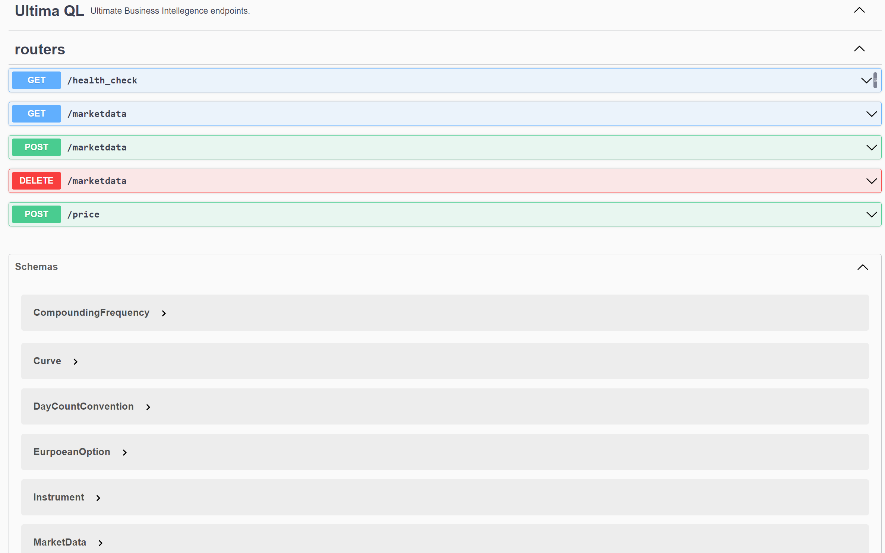

# REST API web application for derivative pricing and market data storage
Fast and scalable server for derivative pricing

# Key features
- Async runtime
- Multithreading for compute intensive pricing
- swagger ui

# Products supported
- EuropeanOptions

# Models supported
- Black76

# Architecture & Tech Stack

## [Rust](https://www.rust-lang.org/) for web sevrer and compute
Although we could easily achieve the same output with Python and Django/Flask the **performance sensitive** nature of our task begs for a better solution. I chose Rust, a modern language compiled to Assembly just like C, for the reasons outlined below:
- No garbage collector, making our server extremely [fast](https://discord.com/blog/why-discord-is-switching-from-go-to-rust)
- **async** frameworks like [Actix](https://github.com/actix/actix-web)
- **multi-core utilization** for compute intensive work (options pricing). Unlike Python, we are not limited by GIL and hence can utilise all cores of the running host. 
- Easy integration with Python. For example [ultibi](https://ultimabi.uk/ultibi-frtb-book/) and [polars](https://github.com/pola-rs/polars) are written in Rust and have very well-functioning python interface (for more details see [pyo3](https://github.com/PyO3/pyo3))

## MongoDB
Naturally, Market Data comes in various shapes and forms. A spot is a totally different object then say Volatility Surface. Hence, Non Structured database would be preffered to 
- Importantly we use **name** (*name of the market data object, eg US_OIS*) and **as_of** (*observation date of the object*) as a unique index. 

# How to Run
### Prerequisites 
 - docker

 ### Steps
 From the top level directory:
 `docker-compose up --build` - this builds two docker images (one from `Dockerfile` which is the backend server and another is the standard mongo image) and run them.

 To check out `swagger docs` navigate to: `http://localhost:8000/swagger-ui/` in your browser. You will see:
 <p align="center">
    <a href="http://localhost:8000/swagger-ui/" target="_blank">
    
    </a>
</p>

### Windows PowerShell
 1) **Upload Market Data**:

```shell
curl.exe -H 'content-type: application/json' -X POST http://localhost:8000/api/marketdata -d '[ {\"name\":\"Brent\",\"as_of\":\"2021-12-01\",\"value\":95.6},
{\"name\":\"OIS\",\"as_of\":\"2021-12-01\",\"day_count_conv\":\"Act365\",\"compounding\":\"Continuous\",\"values\":[[\"2021-12-02\",0.001],[\"2021-12-15\",0.02],[\"2021-12-31\",0.03]]},
{\"name\":\"ImplVol_Brent_100\",\"as_of\":\"2021-12-01\",\"day_count_conv\":\"Act365\",\"compounding\":\"Continuous\",\"values\":[[\"2021-12-02\",0.05],[\"2021-12-15\",0.1],[\"2021-12-31\",0.2]]}
]'
```


 2) **Review/Retrieve Market Data**:
```shell
curl.exe -X GET 'http://localhost:8000/api/marketdata?name=Brent&as_of=2021-12-01'
```

 3) **Price an Option**:
```shell
curl.exe -H 'content-type: application/json' -X POST http://localhost:8000/api/price -d '{\"type\":\"PriceRequest\",\"instrument\":{\"type\":\"EurpoeanOption\",\"underlying\":\"Brent\",\"yield_curve\":\"OIS\",\"implied_vol\":\"ImplVol_Brent_100\",\"strike\":100.0,\"direction\":\"Call\",\"exp\":\"2023-11-30\"},\"date\": \"2021-12-01\"}'
```

 4) **Delete Market Data**:
```shell
curl.exe -X DELETE 'http://localhost:8000/api/marketdata?name=Brent&as_of=2021-12-01'
```